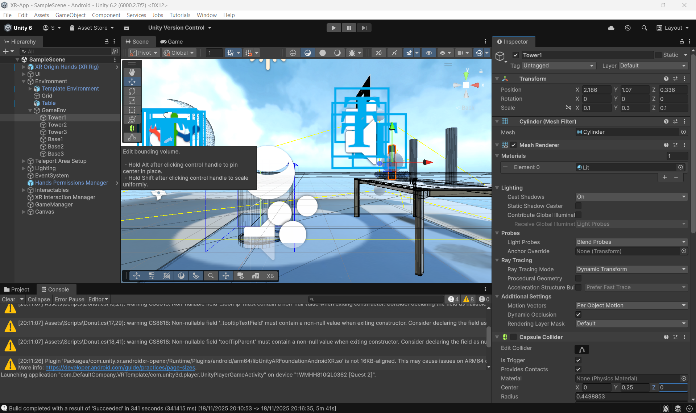
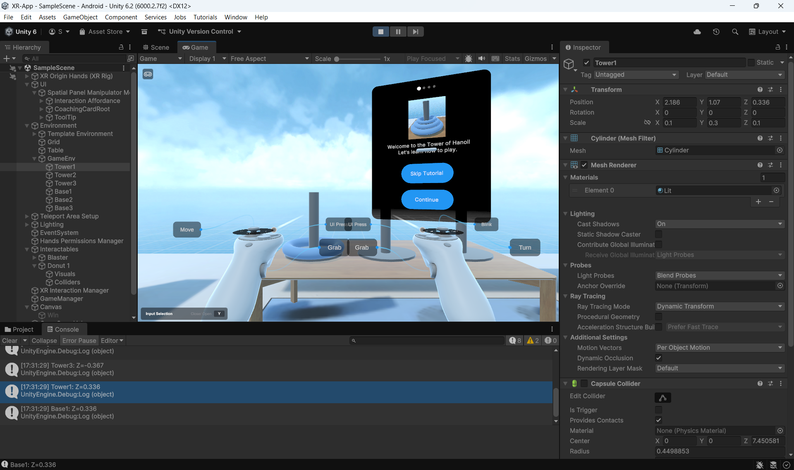

# 📘 Blog 4 – Introduction to Our VR Application Project

## 🎯 Moving from AR to VR  
After completing our first project — an AR navigation system for Horsens train station — we learned a lot about the development process, project scope, and time management.  

While the AR project was exciting, we also realized that the technical complexity and large workload made it challenging to complete within the time available.

For our next project, we decided to choose an idea that is more realistic to implement while still allowing us to learn important XR skills. This led us to develop a small but meaningful VR application.

---

## 🧠 Idea of the project  
For this project, we chose to implement the classic **Tower of Hanoi** puzzle game in Virtual Reality.

The Tower of Hanoi is a well-known logical puzzle that consists of:
- Three towers 
- A set of rings (donuts)
- The goal is to move all rings from the first tower to third tower  
  following the rule that a larger ring cannot be placed on a smaller one.

The game is perfect for VR because it:
- Uses simple 3D objects  
- Is easy to interact with  
- Helps us practice VR mechanics like **grabbing, throwing, interaction, physics, and hand-tracking**  
- Has clear goals and no need for complex animations or environments  

---
## 🎨 Inspiration and project setup

The initial inspiration for this VR project came from Unity’s built-in **VR Template**, which provides a basic environment, interaction system, and XR rig setup. After experimenting with the template, we decided to use it as the starting point for our application.

To create a simple and clear environment for the [**Tower of Hanoi**](https://en.wikipedia.org/wiki/Tower_of_Hanoi) puzzle, we searched for a suitable 3D table model and found one on Sketchfab:  
- https://sketchfab.com/search?q=table&type=models

We imported the table model into Unity and used it as the base for placing the three towers and rings.

---

## 🛠️ Unity setup and device connection

Setting up the project required installing:

- Unity XR Interaction Toolkit  
- Meta Quest 2 integration packages  
- OpenXR plugins  
- VR Template dependencies  

It also took time to properly **connect the Meta Quest 2 headset** to Unity using:
- Meta Quest Link (wired)  
- Oculus PC software  
- Correct OpenXR and runtime settings  

This setup process was a big part of our early work, but it helped us understand the core structure of VR applications.

---

## 💻 Hardware limitations and XRD lab support

We quickly realized that our personal laptops did **not have enough GPU power** to smoothly run the VR application.  
Unity froze often or ran extremely slowly during testing.

Because of this, we were very grateful to have access to the **XRD Lab computers**, which have stronger hardware and allowed us to:

- Run the VR project smoothly  
- Test interactions in real time  
- Work with heavier models and lighting  
- Build and deploy to Meta Quest 2 without crashes  

This significantly improved our workflow and made development possible.

## 🎮 Why this was the right choice  
After experiencing the large scope of the AR project, we wanted to ensure that our next application was:

- ✔ Manageable within the time limit  
- ✔ Technically achievable  
- ✔ Useful for learning Unity VR foundations  
- ✔ Focused on interaction, hand controllers, and gameplay logic  

The VR Tower of Hanoi puzzle lets us learn essential VR development skills **without overwhelming complexity**, while still creating a fun and interactive experience.

---

### 🖼️ VR scene setup in Unity

Below is an early view of our VR environment in Unity, where we imported the
3D table and placed the three Towers of Hanoi stands. This helped us verify
scaling, collisions, and interactions before enabling VR grab logic.

### 🧭 Tutorial Before the Game Starts

When the player launches the VR experience, they first see a short tutorial inside the headset.  
This tutorial explains the goal of the puzzle and how to interact with objects using the VR controllers.

The user can choose to:

- **Skip Tutorial**
- **Continue** to view instructions
- **Select the number of donuts** they want to play with (3, 4, 5, or more)

This helps players understand the rules before starting and allows us to scale the difficulty based on their preferences.

## 📚 Resources

- [**Tower of Hanoi (Wikipedia)**](https://en.wikipedia.org/wiki/Tower_of_Hanoi)

- [**Unity VR template**](https://unity.com/)
- [**Meta Quest 2 – Unity documentation**](https://developer.oculus.com/documentation/unity/unity-gs-overview/)

- [**3D Table Model (Sketchfab)**](https://sketchfab.com/search?q=table&type=models)

- [**VR game mechanics tutorial (YouTube)**](https://www.youtube.com/watch?v=xp37Hz1t1Q8)

